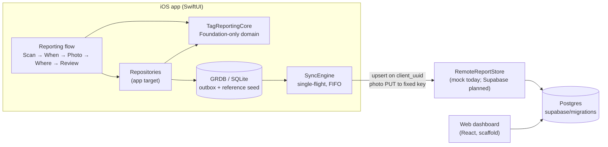

# Loose Tag Reporter

Offline-first iOS proof of concept for reporting loose retail price tags in two taps, with a stable location model, idempotent sync and a schema designed for an auditable escalation workflow.

**Status:** proof of concept, not deployed. It was never piloted and has no real users or data.

## Why it exists

In retail stores that use RFID price tags, the tag links each garment to inventory and, where it is
used, to RFID self-checkout. When a tag is torn or cut off, the garment can't be read at
self-checkout, and inventory still counts it as in stock, so the loss is invisible. Loose tags that
turn up on the shop floor tend to be thrown away, even though each one is an early shrink signal:
it shows roughly where and when a tag was removed, but nothing records it.

This is a personal proof of concept, informed by working in retail. It lets floor staff log a find
in a few seconds (scan, "Now", pick the spot, submit), even offline. The finds add up to a dataset
that shows where and when tags are being removed.

## What it demonstrates

- **Data modelling for a messy real-world signal.** Reports, tags, photos and a tree-shaped location
  taxonomy with deterministic IDs. Found-time is stored as a *window* rather than a false-precision
  timestamp. Item identity can be partial (`unidentified`, nullable `item_code`), so a find is never
  blocked.
- **Governance by design (modelled in the schema; server-side enforcement not built).** The schema
  holds no customer, suspect or biometric data. The only person-linked fields are the reporter's
  staff code (`reporter_emp_id`) and the escalation `actor`; `device_id` identifies a shared, managed
  device. The design makes these visible only to supervisor/LP roles and keeps floor staff
  submit-only; the app has no screen for reading other reports, but row-level security was never
  built. Photos are written with EXIF/GPS stripped. The `escalation_event` table is designed as an
  append-only trail of status changes, and flag rules are designed to prompt a human rather than
  auto-escalate; neither is implemented yet (see Status and limitations).
- **Verification as a first-class artifact.** UUIDv5 golden vectors cross-checked against Python's
  `uuid.uuid5`. Enum-drift tests pin the raw values of five shared Swift enums to the Postgres enum
  labels (held as hard-coded copies; the tests do not read the SQL migrations), and the TypeScript
  types mirror them by hand. A layering/"silent app" guardrail script runs as a pre-build check and in the included CI workflow.
  Sync idempotency tests cover double-trigger and crash-between-upsert-and-photo. The two-decision
  tap budget is itself a unit test.
- **Offline-first sync engineering.** A local GRDB outbox and a single-flight FIFO sync engine, with
  idempotent upserts keyed on a client-generated `client_uuid`, and resume after partial failure.

## Architecture



| Path | What it is |
|------|------------|
| `Packages/TagReportingCore/` | Foundation-only Swift package: domain types, enums, article-number parser, item resolver, found-time windows, `StableLocationID`, repository and seam protocols. Fully unit-tested. |
| `LooseTagReporter/` | SwiftUI app: GRDB persistence, outbox + sync engine, seed import, location survey, reporting flow, session/PIN gate, design tokens. |
| `LooseTagReporterTests/` | App-level tests: persistence round-trips, sync idempotency, survey logic, auth, flow tap budget. |
| `supabase/migrations/` | Postgres enums and core tables (frozen schema). Never applied to a hosted project. |
| `web-dashboard/` | Vite + React + TypeScript shell for the LP dashboard (placeholder screens). |
| `Scripts/layering_guardrail.sh` | CI + pre-build check: Core stays framework-free, Features never import Supabase, no audio APIs. |
| `docs/` | `ADR-001-architecture.md`, `SYNC_CONTRACT.md`, condensed `PRD.md`, `PROGRESS.md`. |

## Key design decisions

1. **Local is the source of truth at capture time.** Submitting writes the report locally and
   enqueues it; nothing waits on the network. The sync engine coalesces concurrent triggers into one
   run, processes the outbox in FIFO order, and stays idempotent server-side via `ON CONFLICT (client_uuid)`
   and fixed photo object keys ([`docs/SYNC_CONTRACT.md`](docs/SYNC_CONTRACT.md)).
2. **Stable location IDs.** Every location node's ID is UUIDv5 of a readable key such as
   `demo-store/GF/SF/fitting_rooms/booth`. Any client or seed generator produces the same ID, and a
   future map picker can bind to it without migrations.
3. **Sales-floor template plus per-store back of house.** Every store shares the same sales-floor
   endpoints, so "Zone B" is comparable across stores. Back-of-house rooms and per-floor exclusions
   are data in a store profile, so a new store needs no code changes.
4. **Identity from the printed article number, parsed on-device.** The parser tolerates OCR noise
   (line wraps, O/0 and I/1 confusion, missing separators) and rejects bare barcodes and internal codes.
   The layout is configurable (`ArticleNumberFormat`). Product reference data only adds names and
   categories; it is never required to submit.
5. **Layering enforced by tooling, not convention.** `TagReportingCore` can't import SwiftUI, GRDB or
   Supabase. This keeps the domain testable with `swift test` on any Mac and keeps the backend swappable.
6. **Thresholds are data.** Flag rules are a minimum tag count per (trading phase × area), with scope
   precedence endpoint > floor > area > global. The seeded defaults are **illustrative only**.
7. **Fail safe on configuration.** Without a managed (MDM) store binding, the app shows a loud dev
   banner and refuses to submit. Without provisioned role PINs, the dashboard gate refuses everything.

See [`docs/ADR-001-architecture.md`](docs/ADR-001-architecture.md) for the full decision record.

## How to run / test

**Core package (any Mac with Swift 5.9+):**

```bash
cd Packages/TagReportingCore
swift test
```

On a machine with only the Command Line Tools (no full Xcode), SwiftPM may not find the
`Testing` framework. Point it at the toolchain's copy:

```bash
FW=/Library/Developer/CommandLineTools/Library/Developer/Frameworks
LIB=/Library/Developer/CommandLineTools/Library/Developer/usr/lib
swift test -Xswiftc -F -Xswiftc $FW -Xlinker -F -Xlinker $FW \
  -Xlinker -rpath -Xlinker $FW -Xlinker -rpath -Xlinker $LIB
```

**Guardrails:**

```bash
bash Scripts/layering_guardrail.sh
```

**iOS app (requires Xcode 16+ and XcodeGen):**

```bash
brew install xcodegen
xcodegen generate
cp LooseTagReporter/Config/Secrets.xcconfig.example LooseTagReporter/Config/Secrets.xcconfig  # optional
xcodebuild -project LooseTagReporter.xcodeproj -scheme LooseTagReporter \
  -destination 'platform=iOS Simulator,name=iPhone 16' test CODE_SIGNING_ALLOWED=NO
```

Replace `iPhone 16` with any simulator installed with your Xcode (`xcrun simctl list devices`).

The app seeds a synthetic **Demo Store** (three floors, generic zones and rooms, 24 fictional
products) from `LooseTagReporter/Resources/Seed/`. The toolbar's "Sample tag" button walks the flow
without a camera. Submit stays disabled without a managed store binding, by design (see decision 7).

**Web dashboard:**

```bash
cd web-dashboard && npm ci && npm run dev
```

A GitHub Actions workflow is included at `ci/ci.yml` (move it to `.github/workflows/` to enable it). It runs the Core tests, the guardrails and the web build
on each push and pull request. The iOS build-and-test job runs only when triggered manually
(`workflow_dispatch`), because this public copy of the app target has not been compiled yet (see
below).

## Status and limitations

- **Proof of concept, not deployed.** It was never piloted and holds no real data. All store, product,
  colour, size and trading-hour data in this repo is synthetic.
- **Live scanning is not implemented.** The scanner screen is a shell. OCR is exercised through a mock
  recognizer and the parser tests, and photo capture is a stub.
- **No real backend.** Sync is proven against an in-memory `MockRemoteReportStore`. The Supabase
  project, row-level security and the real remote store were never built, because the data-residency
  decision was still pending.
- **Escalation is modelled, not built.** The status enum, the `escalation_event` audit table and the
  threshold-rule model exist, but there is no escalation UI and no flag evaluation. No code writes
  `escalation_event` yet, and nothing in the SQL (no trigger or revoked privileges) makes it
  append-only.
- **Access control is designed, not enforced.** Role separation (submit-only floor staff, staff code
  visible only to supervisor/LP) depends on row-level security that was never written.
- **Web dashboard is a scaffold** with placeholder screens.
- **iOS app not rebuilt for this public copy.** The Core package tests (31) and the guardrail were
  re-run on this copy. The app target and its tests passed in the original environment, but this
  public copy has not been compiled, because full Xcode wasn't available when it was prepared.
- Some code comments reference internal task and audit IDs (e.g. `A1-L-004`, `T11`). The planning
  and audit documents behind them are not included.

## How this was built

Built by directing AI coding agents (Claude Code / Cursor). I wrote the specs, the architecture
decisions, the verification gates and the reviews; the agents wrote most of the code under those
constraints.

## License

MIT. See [LICENSE](LICENSE).
